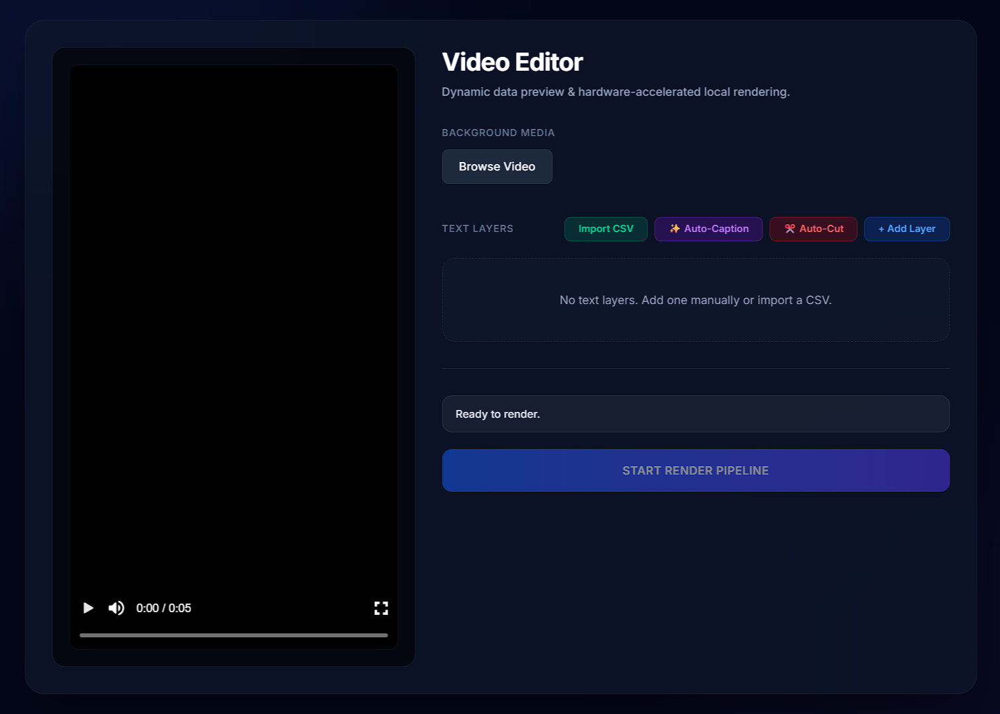

  
  
  <h1 align="center">Video Editor by Fest</h1>

  <strong>A professional desktop application built to automate the most tedious parts of editing short-form vertical content (Shorts, Reels, TikToks). Everything runs 100% locally and offline on your machine. No cloud subscriptions, no API keys, and complete data privacy.</strong>

  
  
  

## ✨ Core Features

- **Offline AI Auto-Captions:** Uses OpenAI's Whisper neural network to transcribe audio into mathematically synced typography animations instantly.
- **Smart Auto-Cut:** Leverages native `FFmpeg` waveform analysis to instantly detect and remove dead air and silent pauses from raw footage.
- **Non-Linear Editing (NLE) Interface:** A custom timeline manager to manually extend, trim, or remove clips with frame-perfect precision.
- **Hardware-Accelerated Rendering:** Mathematically draws and exports the final 9:16 composition as a crisp H.264 MP4.
- **CSV Workflow:** Import hundreds of custom text layers instantly via CSV.

---

---

## 🚀 Download & Installation

You do not need to install Node.js or any developer tools to use this application.

1. Navigate to the **[Releases](../../releases)** tab on the right side of this GitHub repository.
2. Download the latest `Video-Editor-by-Fest-Setup.exe` file.
3. Run the installer.
4. Launch the application from your desktop or start menu!

_Note: Because this application processes AI audio transcription and video rendering locally, it is recommended to run this on a machine with a capable multi-core processor and dedicated graphics for the fastest export times._

## 🛠️ Tech Stack (Under the Hood)

For developers interested in the architecture:

- **Frontend UI:** React, Tailwind CSS, TypeScript
- **Backend Core:** Electron (Node.js), IPC Bridge
- **Media Engines:** Remotion, FFmpeg
- **Machine Learning:** Transformers.js (Whisper-tiny)

## License

This project is licensed under the [MIT License](LICENSE).

---

  Built with care by <strong>Fest</strong>

